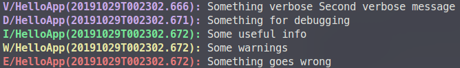

# `> logger`

> A more informative `console.log()`.

```javascript
logger.i('I\'m INFO.');
logger.e('I\'m ERROR.');
logger.v('I\'m VERBOSE.');
logger.v('I log an object.', { id: 12345, name: 'Bob' });
```

